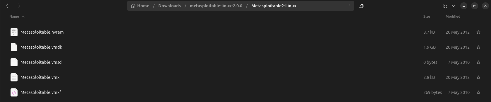
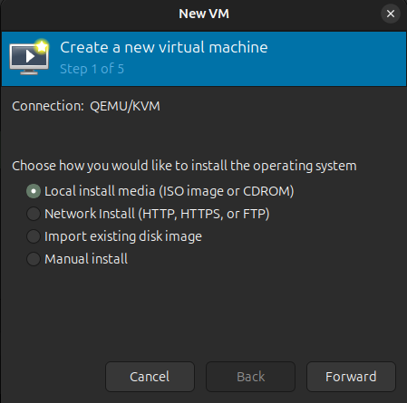
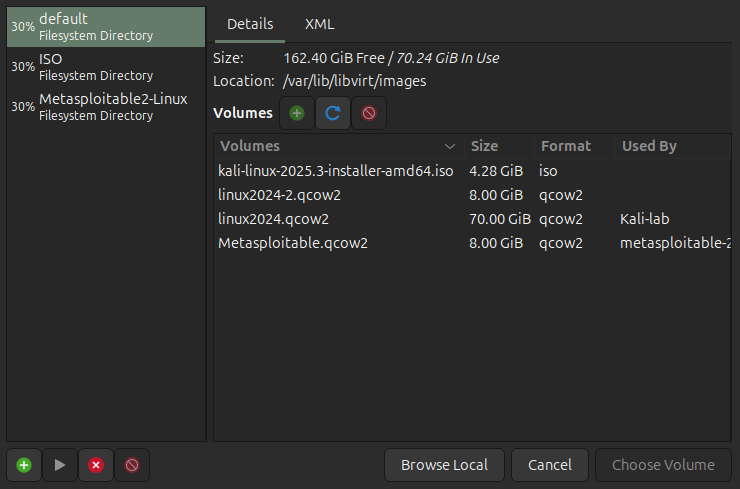
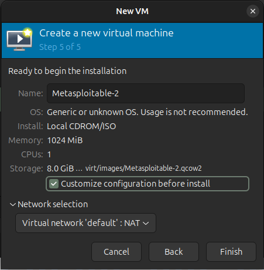
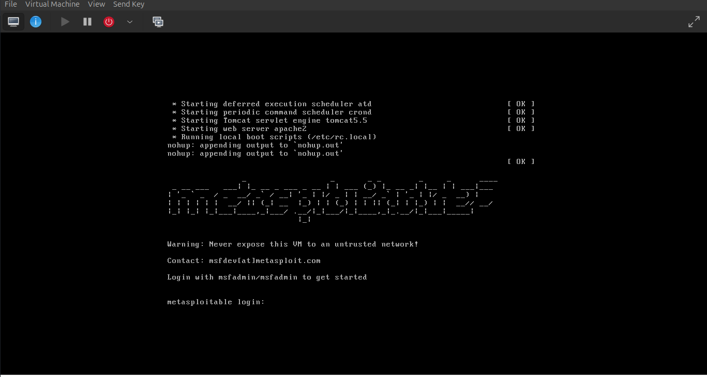
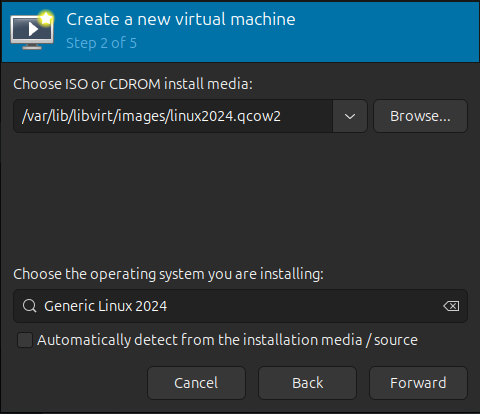
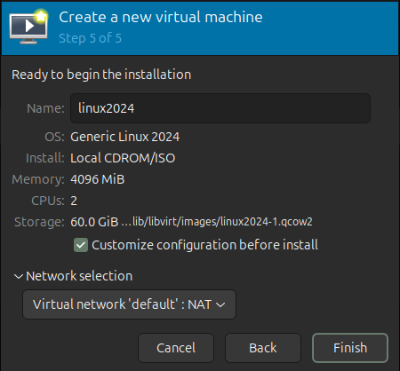
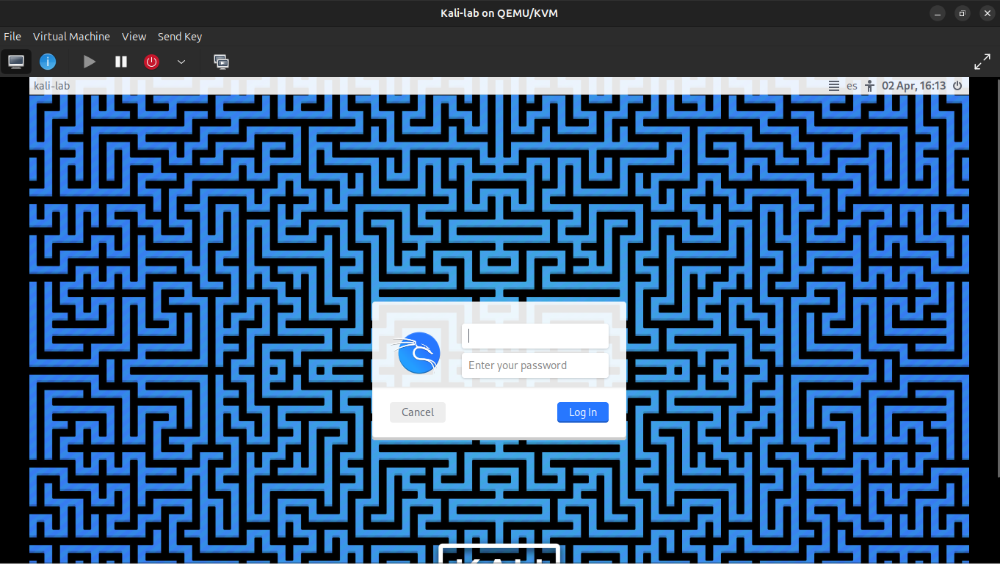
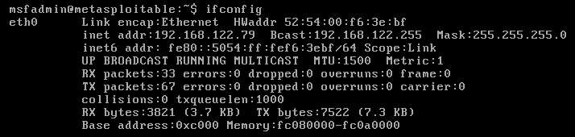
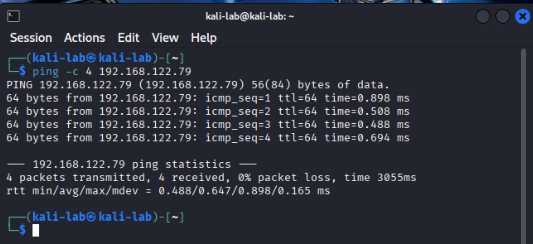

## Comienzo de mi laboratorio de ciberseguridad 
En este proyecto documentó la construcción de mi primer laboratorio de ciberseguridad personal. El objetivo es disponer de un entorno controlado y aislado para practicar técnicas de pruebas de penetración, análisis de vulnerabilidades y aplicar los conocimientos adquiridos en cursos de formación. El laboratorio está compuesto por dos máquinas virtuales: **Kali Linux** como sistema atacante y **Metasploitable2** como sistema objetivo.

## Paso 1: Despliegue de Metasploitable2 en QEMU/KVM

### Descripción general

Metasploitable2 es una máquina virtual Linux desarrollada por Rapid7 diseñada intencionalmente con vulnerabilidades para ser utilizada como entorno de práctica en pruebas de penetración. A diferencia de otras distribuciones, no requiere instalación tradicional ya que se distribuye como un disco virtual preconfigurado en formato `.vmdk`.

### 1.1 Descarga del imagen y configuración:

La imagen fue obtenida desde el sitio oficial de Rapid7: 🔗 [https://www.rapid7.com/products/metasploit/metasploitable/](https://www.rapid7.com/products/metasploit/metasploitable/)

Una vez descargado el archivo comprimido `.zip`, procedemos a extraerlo, lo cual puede realizarse tanto desde el gestor de archivos gráfico como mediante terminal:

```bash
unzip metasploitable-linux-2.0.0.zip
```




Dado que el entorno de virtualización utilizado es **QEMU/KVM**, el cual trabaja nativamente con el formato `.qcow2`, fue necesario convertir el disco virtual desde su formato original `.vmdk` (VMware). Esta conversión se realizó con la herramienta `qemu-img`:

```bash
qemu-img convert -f vmdk -o qcow2 Metasploitable.vmdk Metasploitable.qcow2 

```

`-f vmdk`: Especifica el formato de origen
`-O qcow2`: Especifica el formato de destino

Una vez completada la conversión, el archivo fue movido al directorio estándar de imágenes de libvirt para mantener un orden adecuado en la gestión de recursos virtuales:

```bash
sudo mv Metasploitable.qcow2 /var/lib/libvirt/images/
sudo chown libvirt-qemu:kvm /var/lib/libvirt/images/Metasploitable.qcow2
```

### 1.2. Creación de la máquina virtual
Desde el gestor **QEMU/KVM (Virt-Manager)** se procedió a crear una nueva máquina virtual seleccionando la opción **"Import existing disk image"** y apuntando al archivo `.qcow2` previamente movido.






| Recurso | Valor asignado | Justificación                       |
| ------- | -------------- | ----------------------------------- |
| RAM     | 1024 MB        | Suficiente para el sistema objetivo |
| CPU     | 1 núcleo       | Carga mínima de procesamiento       |
| DISCO   | 8 GB           | Sin intalación requerida            |
| RED     | NAT            | Aislamiento de red por seguridad    |

### 1.3 Consideraciones de seguridad
⚠️ **Aviso importante:** Metasploitable2 contiene vulnerabilidades críticas de forma deliberada. Su exposición a redes externas o a Internet representa un riesgo de seguridad grave. Por esta razón, la máquina fue configurada en modo **NAT**, garantizando que únicamente sea accesible desde el host y las demás VMs del laboratorio, sin visibilidad hacia redes externas. 



### 1.4 Verificación del despliegue 
Una vez iniciada la máquina virtual, el sistema arranca correctamente mostrando la pantalla de login de Metasploitable2. 



Con esto queda confirmado el despliegue exitoso del sistema objetivo en el laboratorio virtual. 

---
## Paso 2: Instalación de Kali Linux en QEMU/KVM 
### Descripción general 
Kali Linux es una distribución basada en Debian desarrollada y mantenida por Offensive Security, orientada específicamente a pruebas de penetración y auditorías de seguridad. En este laboratorio cumple el rol de **sistema atacante**, desde el cual se ejecutarán todas las herramientas y técnicas de análisis contra el sistema objetivo. 
La imagen fue obtenida desde el sitio oficial: 
🔗 https://www.kali.org/get-kali/ 
Se descargó la versión **Installer** para arquitectura **amd64**. 

---
### 2.1 Creación de la máquina virtual 
A diferencia de Metasploitable2, Kali Linux requiere instalación desde una ISO. En Virt-Manager se seleccionó la opción **"Local install media (ISO image)"** y se apuntó al archivo `.iso` descargado. 



Los recursos asignados fueron los siguientes:

| Recurso | Valor asignado    | Justificación                                                   |
| ------- | ----------------- | --------------------------------------------------------------- |
| RAM     | 4096 MB           | Necesario para correr herramientas como Burp Suite y Metasploit |
| CPU     | 2 núcleos         | Mejor rendimiento en tareas de análisis                         |
| DISCO   | 60 GB (dinámico)  | Espacio para herramientas, wordlists y capturas                 |
| RED     | NAT (red virtual) | Misma red que Metasploitable2                                   |




--- 
### 2.2 Proceso de instalación 
Al iniciar la VM arranca el instalador gráfico de Kali Linux. Se seleccionó la opción **Graphical Install** y se completaron los siguientes pasos: 
1. Selección de idioma, región y distribución de teclado 
2. Configuración de hostname (valor utilizado: `kali-lab`) 
3. Creación de usuario y contraseña 
4. Particionado del disco: **Guided - use entire disk** 
5. Selección de entorno de escritorio: **XFCE** (ligero y eficiente) 
6. Instalación del gestor de arranque GRUB en el disco principal 
--- 
### 2.3 Primer arranque
Una vez finalizada la instalación, la VM reinicia y presenta la pantalla de login de Kali Linux. Se inicia sesión con las credenciales configuradas durante la instalación. 



---
## Paso 3: Verificación de conectividad entre VMs
### Descripción general 
Con ambas máquinas virtuales desplegadas, el siguiente paso es verificar que existe comunicación entre ellas dentro de la red virtual NAT. Esto es fundamental para confirmar que el laboratorio está correctamente configurado antes de comenzar cualquier prueba. 

---
### 3.1 Obtener la IP de Metasploitable2 
Desde la consola de Metasploitable2, iniciamos sesión con las credenciales predeterminadas y ejecutamos: ```bash ifconfig ``` Anotamos la dirección IP asignada, que generalmente se encuentra en el rango `192.168.122.x` en mi caso es el `192.168.122.79`



--- 
### 3.2 Verificar conectividad desde Kali Linux 
Desde la terminal de Kali Linux ejecutamos un ping hacia la IP de Metasploitable2: 
```bash 
ping -c 4 192.168.122.X #En mi caso es ping -c 4 192.168.122.79
``` 
Si la respuesta es exitosa, el laboratorio está correctamente configurado y listo para comenzar las pruebas. 

--- 
### 3.3 Resultado esperado 



> ✅ Con la conectividad confirmada, el laboratorio queda operativo y listo para iniciar las pruebas de vulnerabilidad. 
--- 

### 3.4 Lo aprendido en la construcción del laboratorio

Durante el desarrollo de este laboratorio adquirí conocimientos fundamentales en la configuración de entornos virtuales para ciberseguridad. Entre los aspectos más relevantes se destacan:

- **Virtualización con QEMU/KVM:** Aprendí a desplegar sistemas operativos en máquinas virtuales, incluyendo la conversión de formatos de disco (`.vmdk` a `.qcow2`) para garantizar compatibilidad con el hipervisor utilizado.
- **Segmentación y aislamiento de red:** Comprendí la importancia de configurar las VMs en modo NAT para crear una red interna aislada, evitando la exposición de sistemas vulnerables hacia redes externas o Internet.
- **Fundamentos de redes:** Identifiqué y diferencié conceptos clave como dirección IP, gateway, broadcast y rangos de red disponibles, aplicándolos directamente en la configuración del laboratorio.
- **Verificación de conectividad:** Aprendí a confirmar la comunicación entre máquinas virtuales mediante herramientas como `ping` e `ifconfig`, paso esencial antes de iniciar cualquier prueba de penetración.
---
