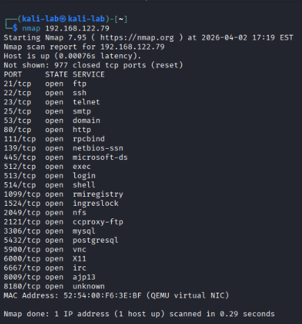
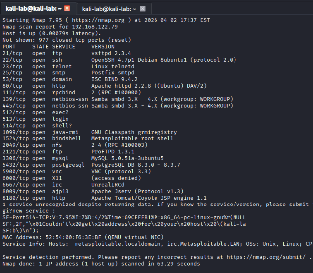
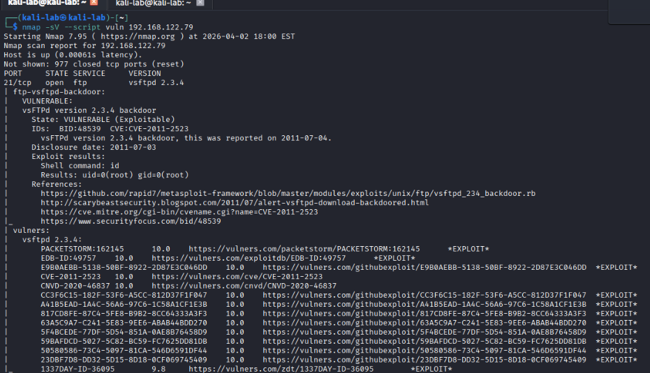
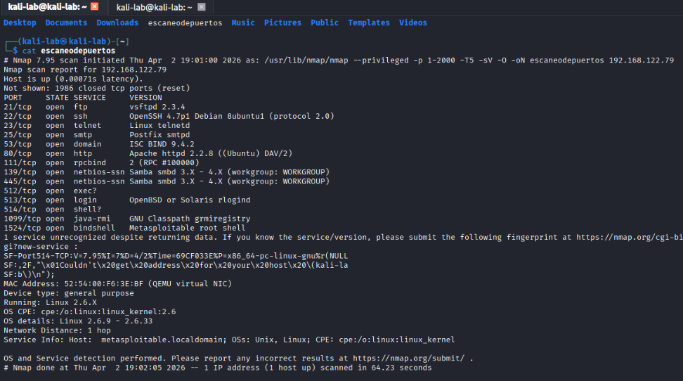

## Paso 4: Reconocimiento con Nmap
### 4.1 Escaneo básico de puertos 
El primer paso en cualquier prueba de penetración es el reconocimiento. Utilizamos Nmap para identificar qué puertos están abiertos en el sistema objetivo: ```bash nmap 192.168.122.79 ``` Este comando envía paquetes TCP a cada puerto del objetivo. Si el puerto responde significa que está abierto y hay un servicio escuchando. Como resultado obtenemos una lista de 23 puertos abiertos, lo cual es inusualmente alto — una máquina bien configurada debería tener 2 o 3 como máximo. 



--- 
### 4.2 Detección de versiones 
Una vez identificados los puertos abiertos, el siguiente paso es conocer las versiones exactas de cada servicio. Esto es clave porque una versión desactualizada puede tener vulnerabilidades públicamente conocidas: 
```bash
nmap -sV 192.168.122.79 
``` 

| Flag  | Descripción                                |
| ----- | ------------------------------------------ |
| `-sV` | Detecta la versión exacta de cada servicio |



Al analizar los resultados se observa que varios servicios datan del año 2008, lo cual representa un riesgo crítico. Esto refuerza una regla fundamental en ciberseguridad:

> ⚠️ **Buena práctica:** Antes de poner en producción cualquier servidor, lo primero es actualizar todos los servicios y el sistema operativo. Una vulnerabilidad no parcheada puede ser explotada en segundos.
 --- 
### 4.3 Análisis de vulnerabilidades
Investigando las versiones encontradas, se identificaron los servicios más peligrosos: 

| **Puerto**  | **Servicio** | **Versión**   | **Severidad** | **Descripción / Vulnerabilidad**                             |
| ----------- | ------------ | ------------- | ------------- | ------------------------------------------------------------ |
| **21**      | FTP          | vsftpd 2.3.4  | Crítico       | Backdoor conocida — permite acceso root directo.             |
| **23**      | Telnet       | Linux telnetd | Alto          | Credenciales viajan en texto plano (sniffing de red).        |
| **80**      | HTTP         | Apache 2.2.8  | Alto          | Versión antigua con múltiples vulnerabilidades web.          |
| **139/445** | Samba        | 3.X           | Crítico       | Vulnerable a ejecución remota de código (RCE).               |
| **1099**    | Java RMI     | GNU Classpath | Alto          | Permite ejecución remota de código (RCE).                    |
| **1524**    | Bindshell    | Root shell    | Crítico       | Shell de root accesible directamente sin contraseña.         |
| **3306**    | MySQL        | 5.0.51a       | Medio         | Base de datos expuesta; propenso a fuerza bruta.             |
| **5900**    | VNC          | Protocol 3.3  | Alto          | Control gráfico remoto; puede permitir acceso no autorizado. |

--- 
### 4.4 Escaneo de vulnerabilidades con scripts 
Nmap incluye una librería de scripts llamada **NSE (Nmap Scripting Engine)** que permite detectar vulnerabilidades conocidas automáticamente: 

```bash 
nmap -sV --script vuln 192.168.122.79 
``` 

| Flag            | Descripción                                                |
| --------------- | ---------------------------------------------------------- |
| `--script vuln` | Ejecuta scripts de detección de vulnerabilidades conocidas |

 

El resultado confirma que el puerto 21 con vsftpd 2.3.4 tiene una backdoor activa, entre otras vulnerabilidades detectadas en los demás servicios.

--- 
### 4.5 Generación de informe con Nmap 
Para documentar los hallazgos de forma profesional, Nmap permite exportar los resultados a un archivo: 
```bash
nmap -p 1-2000 -T5 -sV -O -oN escaneodepuertos 192.168.122.79
```

|**Flag**|**Descripción**|
|---|---|
|**`-p 1-2000`**|Define el rango de puertos a escanear (en este caso, del 1 al 2000).|
|**`-T5`**|Ajusta la plantilla de tiempo a nivel "Insane". Es la velocidad máxima, pero es muy intrusiva y ruidosa para los IDS.|
|**`-sV`**|Escaneo de servicios. Intenta determinar la versión específica de lo que se ejecuta en cada puerto.|
|**`-O`**|Activación de la detección de Sistema Operativo mediante el análisis de la pila TCP/IP.|
|**`-oN archivo`**|Guarda el resultado en formato normal (texto plano) en el archivo especificado.

> 💡 **Nota:** El parámetro `-T` va del 0 (más lento y sigiloso) al 5 (más rápido y ruidoso). En entornos reales se recomienda usar `-T2` o `-T3` para evitar ser detectado por sistemas de defensa. 

Para ver el archivo generado: 
```bash 
cat escaneodepuertos 
``` 


