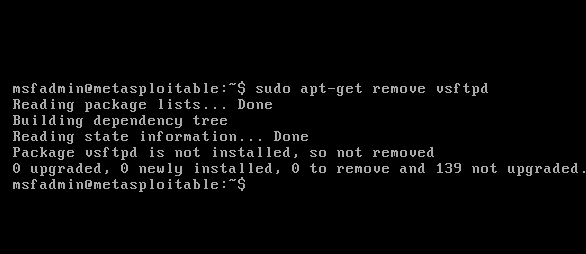
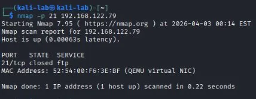

## Paso 6: Defensa y Remediación

### Descripción general

Una vez que hemos explotado exitosamente la vulnerabilidad del puerto 21, el siguiente paso es aplicar una remediación. Esto es fundamental en ciberseguridad — no basta con encontrar y explotar una vulnerabilidad, un profesional completo también sabe cómo corregirla.

En este caso mantendremos el resto de servicios vulnerables para continuar practicando, y únicamente corregiremos el puerto 21.

---

### 6.1 Acceso al sistema objetivo

Desde la consola de Metasploitable2 iniciamos sesión con las credenciales predeterminadas:
```
usuario: msfadmin
contraseña: msfadmin
```

---

### 6.2 Opciones de remediación

Existen tres enfoques dependiendo de si el servicio FTP es necesario o no para el negocio:

---

#### Opción 1 — Desinstalar vsftpd completamente

Si el servidor no requiere transferencia de archivos bajo ninguna circunstancia, la mejor decisión es eliminar el servicio por completo. Un servicio que no existe no puede ser explotado:
```bash
sudo apt-get remove vsftpd
```

---

#### Opción 2 — Deshabilitar el servicio temporalmente

Si se quiere mantener vsftpd instalado pero fuera de servicio, se puede detener el proceso. Útil cuando se evalúa una migración pero aún no se ha completado:
```bash
sudo service vsftpd stop
```

Para verificar que el puerto 21 ya no está escuchando:
```bash
sudo netstat -tlnp | grep 21
```

Si el comando no devuelve ningún resultado, el puerto está cerrado. 

---

#### Opción 3 — Reemplazar FTP por SFTP 

Esta es la solución profesional cuando el servicio de transferencia de archivos es esencial. En lugar de simplemente apagar FTP, lo reemplazamos por **SFTP**, que cumple la misma función pero con cifrado completo de extremo a extremo.

> 🔴 **¿Por qué FTP es inaceptable en producción?** FTP transmite las credenciales y los archivos en texto plano sin ningún tipo de cifrado. Cualquier atacante en la misma red puede interceptar el tráfico con herramientas como Wireshark y ver usuario, contraseña y contenido de los archivos en tiempo real.

La diferencia entre los protocolos es la siguiente:

| Protocolo | Puerto | Cifrado     | Uso recomendado     |
| --------- | ------ | ----------- | ------------------- |
| FTP       | 21     | Sin cifrado | Nunca en producción |
| FTPS      | 21/990 | SSL/TLS     | Aceptable           |
| SFTP      | 22     | SSH         | Siempre             |

SFTP funciona sobre el protocolo SSH en el puerto 22, por lo que no requiere abrir puertos adicionales en el firewall. Para instalarlo:
```bash
sudo apt-get install openssh-server
sudo apt-get remove vsftpd
```



De esta forma eliminamos completamente FTP y lo reemplazamos por SFTP, garantizando que en ningún momento el puerto 21 esté habilitado ni accesible.

---

### 6.3 Verificación desde Kali Linux

Una vez aplicada la remediación, volvemos a Kali y verificamos que el puerto 21 ya no es accesible:
```bash
nmap 192.168.122.79 -p 21
```

El resultado esperado es:
```
PORT   STATE  SERVICE
21/tcp closed ftp
```



Si el estado muestra `closed` la remediación fue exitosa. ✅

**Lección extra:** Desinstalar un software no garantiza que el puerto quede cerrado inmediatamente. Siempre hay que verificar con `lsof` o `netstat` qué proceso está usando el puerto y cerrarlo explícitamente.

---

### 6.4 Lección aprendida

> 🧠 **Regla de oro:** Si un servicio es esencial para el negocio, nunca lo elimines sin ofrecer una alternativa segura. La seguridad no debe ir en contra de la operación — debe adaptarse a ella. En este caso FTP fue reemplazado por SFTP, manteniendo la funcionalidad de transferencia de archivos pero eliminando por completo el riesgo de exposición de credenciales.

---

### Cierre del laboratorio

Con este paso concluye la construcción y documentación del primer laboratorio de ciberseguridad. A lo largo de este proyecto se cubrió el ciclo completo de una prueba de penetración básica:

| Fase | Herramienta | Resultado |
|---|---|---|
| Despliegue del entorno | QEMU/KVM | Lab aislado y operativo |
| Reconocimiento | Nmap | 23 puertos abiertos identificados |
| Análisis de vulnerabilidades | Nmap --script vuln | Backdoor vsftpd 2.3.4 confirmada |
| Explotación | Metasploit | Acceso root obtenido |
| Remediación | SFTP | Puerto 21 cerrado y reemplazado |

> Este laboratorio demuestra no solo la capacidad de explotar vulnerabilidades, sino también el criterio para remediarlas de forma profesional — habilidad fundamental en cualquier rol de ciberseguridad.